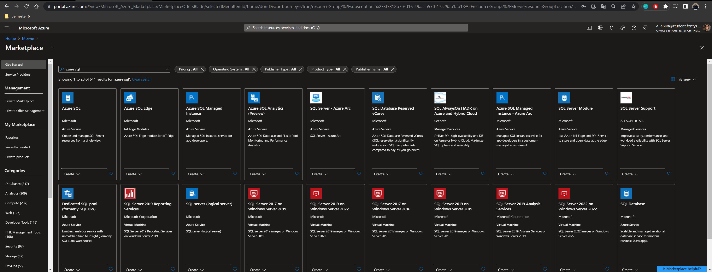
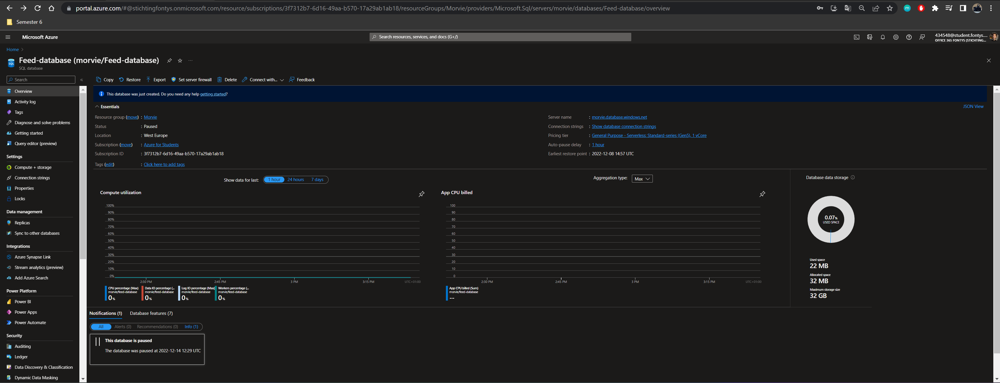
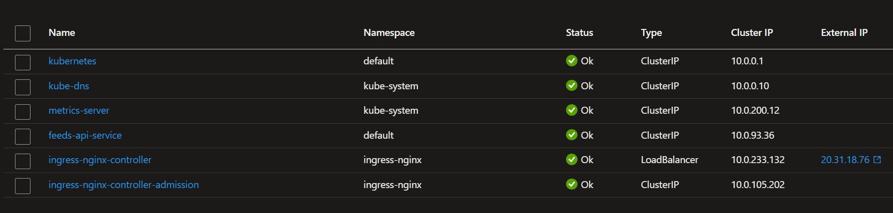
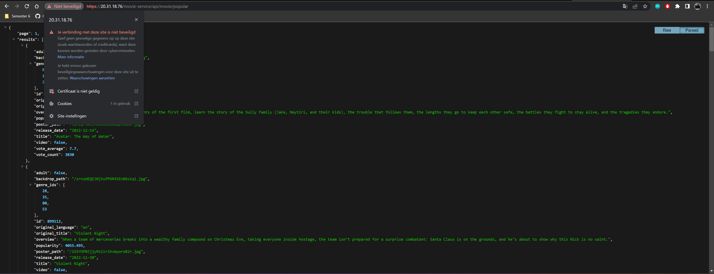
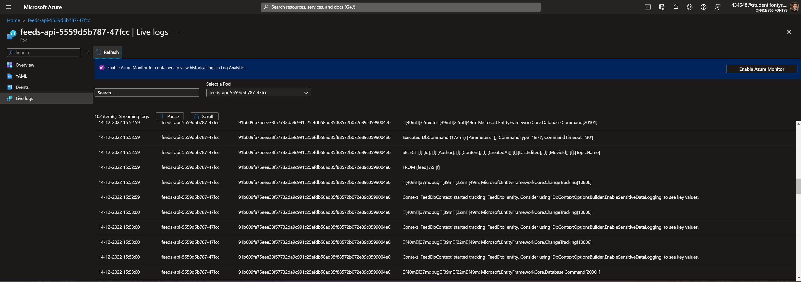
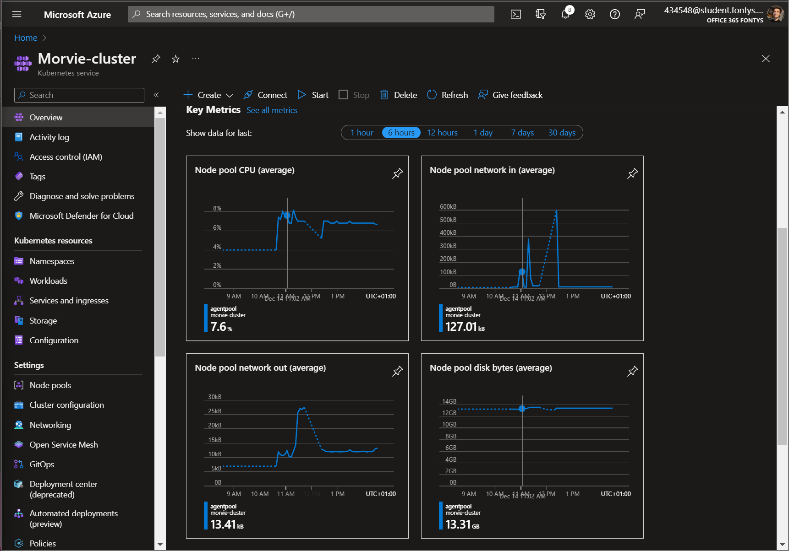

---

<a name="readme-top"></a>

<!-- PROJECT LOGO -->
<br />
<div align="center">
  <a>
    
  </a>

  # Cloud provider and services
</div>

&nbsp;
&nbsp;

## What is the cloud?

The cloud is basically the internet. 
And it is a general term for anything that involves in delivering hosted services over the internet. Instead of just using the tradional hosting over one single server. But instead its gets hosted over a network of connected virtual and physical cloud servers. This ensures a more `scalable` and `flexible` hosting of website and applications. So, if one service gets overloaded or a server is down, the cloud will redirect the user to an another cloud server.

And can offer the option to host databases of SQL and NoSQL servers as well.

It can be seen as a platform-as-a-service (PaaS), in which software services can be integrated into with the software application. Such as:
- data storage
- data analysis
- monitoring and logging
- Container Orchestration
- Autoscaling
- Database solutions

But there is also Software-as-a-service `SaaS`, and Infrastructure-as-a-service: `IaaS`. For this project, I will look up the IaaS services and will consider the options within my project.

And will I use a public cloud over the private and hybrid cloud options. This is because I simply do not have the money to buy my own physical hardware for hosting the cloud myself. 

&nbsp;

***GDPR Sensitive!*** 

So, since I do not use a private hosting option. I do have to keep in mind, I can not control the physical server and have to rely on the provider. So, the  third-party could abuse usage over the cloud-services and get user sesitive data! Which can harm the GDPR rules over personal data that could be stored within the future in this application.

&nbsp;
&nbsp;

## What are the needs for this project with Cloud-hosting?

### Google cloud

<table align = center>
  <tr>
    <th width="200">
    </th>
    <th width="600">
      Explaination of usage
    </th>
    <th width="600">
      Average Costs €
    </th>
  </tr>
  <tr>
    <td>
      Autoscaling
    </td>
    <td>
      Maximizes the application reposiveness by scaling up the cluster automatically when needed.
      It is a Infrastructure feature that can either horizontally or vertically scale up the cluster.
    </td> 
    <td>
      No given costs, since it charges the company or user the cost it is using. So, if suddenly the website gets one hundred thousand requests. It scales automatically up.
    </td> 
  </tr>
  <tr>
    <td>
      Cloud Databases 
    </td>
    <td>
      <p>The cloud database comes with encryption over data that gets stored in the cloud database. And is over  <code>SSAE 16, ISO 27001</code> and <code>PCI DSS  complaint.</code>
      It provides a 99,95% availability of access and functionality anywhere in the world. 
      And can also automatically replicate itself to reduce the number of overloading.    
      </p>
    </td>
    <td>
      €10.95 euros a month
    </td> 
  </tr>
  <tr>
    <td>
      Registry and hosting
    </td>
    <td>
      Needed for hosting and deploying the Kubernetes cluster to the cloud environment. 
    </td>
    <td>
      €53.44 for hosting the environment with using kubernetes. Where the access to <code>1vCPU</code> and <code>3,75 GB of RAM memory</code> is given.
    </td> 
  </tr>
  <tr>
    <td>
      Self-signed certificate
    </td>
    <td>
      Needed to make everything secure by having <code>HTTPS</code>. So that the connection between services and gateways have a encrypted connection. 
    </td>
      <td>
        € free of costs.
    </td>
  </tr>
</table>

&nbsp;
&nbsp;

### Azure cloud

<table align = center>
  <tr>
    <th width="200">
    </th>
    <th width="600">
      Explaination of usage
    </th>
    <th width="600">
      Average Costs €
    </th>
  </tr>
  <tr>
    <td>
      Cloud Databases 
    </td>
    <td>
      In Azure, all newly created databases are encrypted by default and the database encryption key is protected by a built-in server certificate. Also access protection can be setup to even more limit the numbers of people that can have access to the database. 
      </p>
    </td>
    <td>
      €12,- euros a month
    </td> 
  </tr>
  <tr>
    <td>
      Registry and hosting
    </td>
    <td>
      Needed for hosting and deploying the Kubernetes cluster to the cloud environment. 
    </td>
    <td>
      €0,097 per cluster per hour for hosting in Germany North.
    </td> 
  </tr>
  <tr>
    <td>
      Self-signed certificate
    </td>
    <td>
      Needed to make everything secure by having <code>HTTPS</code>. So that the connection between services and gateways have a encrypted connection.
    </td>
      <td>
        € free of costs. But is not a real SSL-certificate. The services can get the certificate but is charged extra.
    </td>
  </tr>
</table>

&nbsp;
&nbsp;

## Options as Cloud-providers

<table align = center>
  <tr>
    <th width="150">
    </th>
    <th>
        
    </th>
    <th>
        </a>
    </th>
    <th>
        </a>
    </th>
  </tr>


  <tr>
    <td align = center>
      <strong>Company Name:</strong>
    </td>
    <td align = center>
      Amazon Web Services
    </td>
    <td align = center>
      Azure Cloud Services 
    </td>
    <td align = center>
      Google Cloud Services
    </td>
  </tr>


  <tr>
    <td align = center>
      <strong>Student credits</strong>
    </td>
    <td align = center>
      ❓/ ✅
    </td>
    <td align = center>
      ✅
    </td>
    <td align = center>
      ✅
    </td>
  </tr>


  <tr>
    <td align = center>
      <strong>Offer for students</strong>
    </td>
    <td align = center>
      <code>Education version of AWS</code>, where it is not specified what it offers. However, it offers courses for students and employees for companies. Furthermore, this option needs to registered with an credit-card.
    </td>
    <td align = center>
      <code>Offers an €100,- student credits</code> for their services, when registering the student e-mail. 
      According to Fontys both normal email and FHICT email work for registering to this student deal!  
    </td>
    <td align = center>
      Google Cloud provides a free trial account option, along with <code>$300 credit.</code> And this is only available for 90 days!
    </td>
  </tr>


  <tr>
    <td align = center>
      <strong>Most popular cloud provider (StackOverFlow)</strong>
    </td>
    <td align = center>
        <h3>🥇</h3>
    </td>
    <td align = center>
       <h3>🥈</h3>
    </td>
    <td align = center>
       <h3>🥉</h3>
    </td>
  </tr>
</table>

&nbsp;
&nbsp;

## Popularity chard by StackOverflow

<div align = center>
  </a>
</div>

&nbsp;
&nbsp;

# Azure hosting and deployment

So I have chosen to host my application in Azure. The reason for this is due to the fact that Azure provides good documentation and support with .NET applications. This is beneficial because the microservices are primarily built with .NET framework.

So I have started out with creating a registry on the Azure environment and made a cluster for the needed services. 

&nbsp;
&nbsp;

<div align = center>
  </a>
</div>

&nbsp;
&nbsp;

## Creating Azure database.

In order to create a database with Azure, I needed to add a SQL server in Azure. I choose the option to create `Azure MySQL` server. In order to make the database work with my application instead using other providers. This also has some benefits as mentioned in my <a href = "https://github.com/Morvie/Documentation/blob/main/Documents/GDPR-documentation.md">GDPR-document</a>, since it comes with available `Consistency` and `Availability` as database guarantees. 

<div align = center>
  </a>
</div>

&nbsp;

In order to make the database work, the need was needed to add new databases to the server. So, I did add `Azure databases` to the `Azure database server`. And so we need to add this to the resources as well.

<div align = center>
  </a>
</div>

&nbsp;

<div align = center>
  </a>
</div>

And as well as firewall security settings, which needs to be added as well. 
Otherwise, the applications that are connected to this database will not receive any data because of the firewall rules.

&nbsp;

<div align = center>
  </a>
</div>


## Creating a Kubernetes manifest file.

I have created a manifest file in which contains all items that is needed to deploy a microservice to Azure. There are three things needed in order to deploy a microservice to the Azure cloud, which are: 
- Deployment file.
- Service file
- Ingress file.
- Autoscaler file.

All these files have their own purpose, in which I will explain shortly what their purpose is. And how these files contribute to the cloud-deployment. 

#### Kubernetes | Deployment file

``` yml
# Deployment to the Kubernetes Cluster:
apiVersion: apps/v1
kind: Deployment
metadata:
  name: feeds-api
  labels:
    app: feeds-api
spec:
  replicas: 1
  selector:
    matchLabels:
      app: feeds-api
  template:
    metadata:
      labels:
        app: feeds-api
    spec:
      containers:
        - name: feeds-api
          image: markgoertz/feedmessages:latest
          imagePullPolicy: Always
          ports:
          - containerPort: 443
          resources:
            requests:
              cpu: 100m
              memory: 100Mi
            limits:
              cpu: 200m
              memory: 200Mi
```

The deployment file is basically a configurations file that contains a few configurations the developer can configure. This is needed since somewhere there has to be described what configurations it needs to use in order to properly function. 

- **Replica's:** this describes the numbers of pods that can be created in order to maintain a stable set of pods at any given time. If a pod fails or is evicted, the cluster will automatically generate/create new pods to back-up and lower the load on the server.

- **Image:** Copies the Docker image which is described here. Currently is it at `markgoertz/feedmessages` and always gets the latest available image.

- **Port** With the port defined, the Ingress controller and application gets appointed to the right port. With port:`443` we can activate the TLS connection for the application.

- **Resources** The resources define the limit of using computing resources of the server. With CPU and RAM memory being as metrics units, the hosting gets limited to optimize the performance, eror-handling and network resources of the application as well for the server.

---

### Kubernetes | Autoscaler file

``` yml
apiVersion: autoscaling/v1
kind: HorizontalPodAutoscaler
metadata:
  name: feeds-api
spec:
  scaleTargetRef:
    apiVersion: apps/v1
    kind: Deployment
    name: feeds-api
  minReplicas: 1
  maxReplicas: 8
  targetCPUUtilizationPercentage: 75
status:
  currentCPUUtilizationPercentage: 0
  currentReplicas: 1
  desiredReplicas: 1
```

This is the horizontal autoscaler of Kubernetes. It's purpose is to automatically scale up when the current pod gets overloaded by 75% CPU usage that was assigned earlier in the `deployment-file`. And automatically replicates itself until a max of eight pod replicas.

---

####  Kubernetes | Ingress Controller file

```yml 
# Ingress controler for Kubernetes Cluster:
apiVersion: networking.k8s.io/v1
kind: Ingress
metadata:
  name: morvie-ingress
  namespace: default
  annotations:
    nginx.ingress.kubernetes.io/ssl-redirect: "true"
    nginx.ingress.kubernetes.io/use-regex: "true"
    nginx.ingress.kubernetes.io/rewrite-target: /$2
spec:
  ingressClassName: nginx
  rules:
  - http:
      paths:
      - path: /feeds-service(/|$)(.*)
        pathType: Prefix
        backend:
          service:
            name: feeds-api-service
            port:
              number: 443
```
The Ingress Controller provider that I used within the cluster is of `NGINX`. NGINX providers a good loadbalancer and serves as an advanced reverse proxy. 

Within the NGINX ingress controller configurations, the routes get automatically redirected to a secure transfer-protocol: `HTTPS` instead of `HTTP`. And does it currently route all request from the `feed-api-service` aunder the path-name: `/feeds-service`.

---

#### Kubernetes | Service file

```yml
# Service for the API:
apiVersion: v1
kind: Service
metadata:
  name: feeds-api-service
spec:
  type: ClusterIP
  ports:
    - protocol: TCP
      port: 443
      targetPort: 443
  selector:
    app: feeds-api
```
A Kubernetes service is a logical abstraction for a deployed group of pods in a cluster (which all perform the same function)

It creates and enable pods to perform operations for them but share the results under a single IP-address. Since there are many types of services for Kubernetes, I choose to pick the service: ClusterIP, which means that Internal clients can send requests to a stable internal IP-address. And so are a couple more services available:
- NodePort
- LoadBalancer
- ExternalName
- Headless

And if everything went as smootly and optional, the Kubernetes cluster should contain the new deployment and services!
<div align = center>
  </a>
</div>


## Demostration of cloud-hosted services

Here is one of my Azure cloud-hosted services that is demostrated for its working purpose!

<div align = center>
  </a>
</div>

<div align = center>
  </a>
</div>


---

## Logging and monitoring

With logging and monitoring of applications can simply be done by the sources the cloud provider provides. With the local development I used `minikube` which comes in with a logging over local `pods` and `deployments`.

When using Azure, the cloud provider comes with a in-build monitoring tool that gives developers an insight in the `application health` over pods and deploys. And can deliver a log over the application' loggin messages.

#### Pod status logging

<div align = center>
  </a>
</div>


#### Loadtesting | Server and Network load. 

<div align = center>
  </a>
</div>

With the tool `K6`, I managed to load test the application to tests it scalabillity. The result of K6 looked like this without any scaling:

<div align = center>
  </a>
  

</div>

Tested with `2k users ` as mentioned non-functional requirement, I wanted to test the application speed of a HTTP-request. Ideally it would take under 0.5 secondes to complete the request with those number of users:

And within this test it did complete on average for `95% in 0.502 seconds` which is great for using the autoscaler. 


<div align = "center">
  
  It started using more resources, and also started to scale up the usage of pods with its autoscaler.
</div>

&nbsp;

And then I decided to test the `POST-request `of the application, and started with testing the POST:


<br/>

## Future recommendations on expansion.

*based the landscape of cloud service providers, e.g. Azure, Google, AWS, DigitalOcean you have done, give recommendations w.r.t. the future expansion of your application (vertical or horizontal)*

### What is horizontal and vertical scaling in cloud hosting?

The cloud has two options to automatically scale up when the service gets overloaded. These two options are scaling up in the horizontal or vertical way. And I want to explain what both of them do, and why it improves the availability of the application services.

---

**Horizontal scaling:** 

➡️*This way of scaling up has to do with the server itselves, each program running on the server resources gets a amount of assigned server resources it can use. And when it gets override to a certain level of usage, it automatically duplicates its program to a new server resource so, that the application service's load gets reduced and divided.*

So, in KuberNetes the pod gets duplicated to a new pod and it can be limited to a number of pods in order to not overload the server itselves by pods. It is very reliable and has a great redundancy in a rare event of an outage.

The cons of using horizontal scalling as technique to scale up the application, is that the cost could be higher compaired to the vertical scaling if not configured correctly.

---

**Vertically scaling:** 

➡️*With scaling the application vertically, instead of duplicating itselves, it scales up in usage of server resources. It can also be cheaper when configured corrrectly.*

The cons of using this method is that it could still overload the server if the server is not configured properly. If there is used a manual of scheduled scaler, this will not act on the actual load of the server. And could be to much usage or to less. So, it would be not cost and usage efficient.

---


# Sources:
* Fontys (n.d) Fontys.nl https://fhict.instructure.com/courses/12452/pages/cloud-services-theoretical-background?module_item_id=829969

* Chai, W., & Bigelow, S. J. (2022, November 10). cloud computing. Cloud Computing. https://www.techtarget.com/searchcloudcomputing/definition/cloud-computing

* (2022, December 3). StackOverflow. https://insights.stackoverflow.com/trends?tags=azure%2Camazon-web-services%2Cgoogle-cloud-platform%2Cdigital-ocean&_ga=2.65165606.945540501.1670098375-1087063840.1670098375

* What is cloud hosting. (n.d.). IBM. https://www.ibm.com/cloud/learn/what-is-cloud-hosting

* Hui, J. (2021, March 25). Azure Autoscaling: A Practical Guide. Spot by NetApp. https://spot.io/resources/azure-pricing/azure-autoscaling-a-practical-guide/

* AWS Educate. (n.d.). Amazon Web Services, Inc. https://aws.amazon.com/education/awseducate/

* Google Cloud. (n.d.). Cloud Computing Services  |. https://cloud.google.com/

* Cloud SQL for PostgreSQL, MySQL, and SQL Server  |  Cloud SQL: Relational Database Service  |. (n.d.). Google Cloud. https://cloud.google.com/sql/?utm_source=google

* Pricing Calculator. (n.d.). Microsoft Azure. https://azure.microsoft.com/en-us/pricing/calculator/?

* AWS Pricing Calculator. (n.d.). https://calculator.aws/

* Services  |  Google Kubernetes Engine (GKE)  |. (z.d.). Google Cloud. https://cloud.google.com/kubernetes-engine/docs/concepts/service*

* CloudCheckr | 8 July 2021 | https://cloudcheckr.com/cloud-automation/horizontal-vertical-cloud-scaling/
