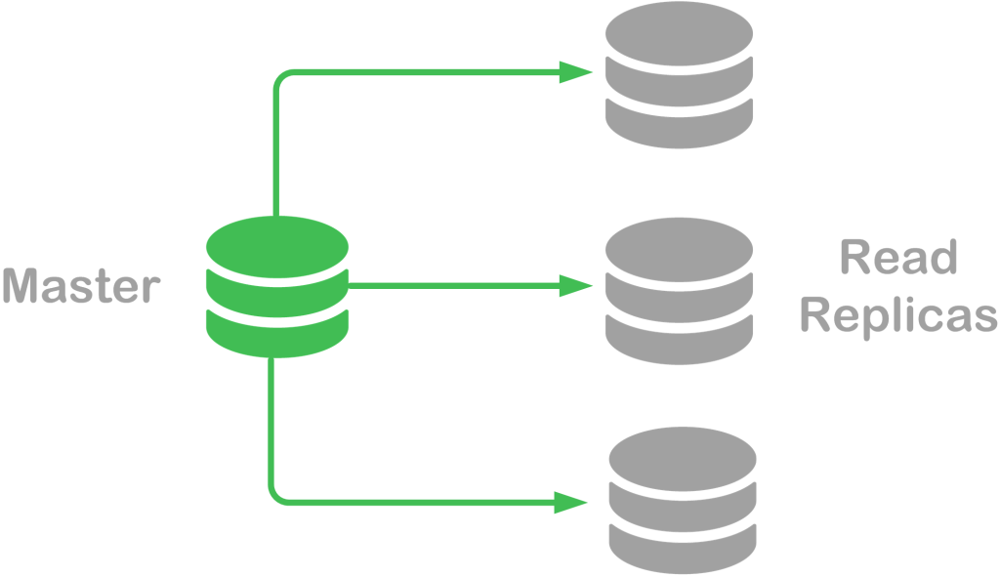

# Scalability research.

## Differences between SQL and NoSQL databases in scalability.

There are a several differences between a SQL and NoSQL database. These differences do have a impact on the database usage for this application and affects the performance speed for the application. In order to make the best choice in database, I want to consider the differences between these two database types and try to make the best choice:
1.	SQL databases are relational which means the data can have a relation with each other. While No-SQL are not relational. 

2.	SQL uses its own Structured Query Language known as SQL. And has a predefined schema for the data. While the NoSQL database have dynamic schemas with unstructured data.

3.	SQL database are vertical scalable while NoSQL is horizontally scalable. For the SQL database this means that the load on a single server can be increased by things like RAM, CPU and SSD.
On a NoSQL database the traffic can be handled by sharding or adding more servers in the NoSQL database.

So, in the long run: it better to have a database with multiple servers so it can be larger and more powerful than a single server.

    

4.	SQL database uses a multi-row transaction and so, uses this to structure data. While NoSQL uses unstructured data to store documents or JSON.

5.	In general, both database types are evenly fast on depends on the context. 

SQL databases are normalized databases where data is structured down into various tables to avoid data redundancy and data duplication. And executes the reading operations of data in large volumes faster than a NoSQL database. Which is better for doing multiple read operations at simultaneous time. 

The NoSQL databases are designed for unstructured data which can be document-oriented or graph-oriented. So, writing operations on NoSQL databases are faster compared to SQL databases. Because it is a schemeless database, this speeds up the development process. And executes the write operations such as create and update faster than the structured SQL databases.

&nbsp;
&nbsp;

## How to make databases scalable?

To make the database scalable, a technique can be implemented within the software architecture called: “database caching”. This technique allows the data to be cached and prevent the database to be overloaded by requests. 
How does it work? 
-	This technique works by storing the query statements shortly in the application or cache database. And by setting up the right configurations, the query statements will be executed to the main database on every 2 minutes. This is beneficial when you want the network traffic to lower the latency and keep the scalability and performance high.

- By using Kubernetes where it is possible to make replicatas of databases in the same cluster. It replicates the main database and load balance over the databases. In combination with CQRS is this a very powerful and scalable solution!

&nbsp;
&nbsp;

 

&nbsp;
&nbsp;

## How does the CQRS-code pattern contribute to better scalable applications?

CQRS stands for Command Query Responsibility Segregation and is a pattern that separates read and update operations for a datastore. Compared to traditional architecture the same data model to perform query and update to the database is more complex to implement and can maximize performance, scalability and security.

Due to its so called: Command and Query, the application has two divided tasks that each can specialize to.

- Commands are responsible to perform task-based operations such as POST and UPDATE.
- Queries are responsible for receiving information from the database and can never modify the database.

So, the application structure gets divided into two separate structures: a command and query services. And so, it separately can perform its own actions. Which allows the data schema’s to be optimized for queries and the write side uses a schema optimized for updates. For security reasons it easier to ensure that the right domain entities are performing writings on the data.

Combined with the benefits of SQL and NoSQL databases, the application can rapidly perform actions to the NoSQL database. And receive data from the SQL database. In between the databases can communicate through an Event handler or synchronization. 

## Sources:
* CQRS pattern - Azure Architecture Center*. (z.d.). Microsoft Learn. Geraadpleegd op 10 oktober 2022, van <https://learn.microsoft.com/en-us/azure/architecture/patterns/cqrs>

* Engineering, R. (2022, 31 mei). *CQRS Explained*. RisingStack Engineering. Geraadpleegd op 10 oktober 2022, van <https://blog.risingstack.com/cqrs-explained-node-js-at-scale/>

* What is a database cache and how does one use it? (2012, September 1). Stack Overflow. Retrieved October 5, 2022, from https://stackoverflow.com/questions/12227752/what-is-a-database-cache-and-how-does-one-use-it

* Nnakwue, A. (2021, April 7). Caching in Node.js: Optimizing app performance with Redis. LogRocket Blog. Retrieved October 5, 2022, from https://blog.logrocket.com/caching-node-js-optimizing-app-performance-redis/

* Smallcombe, M. (2018, 29 november). SQL vs NoSQL: 5 Critical Differences. Integrate.io. Geraadpleegd op 5 oktober 2022, van https://www.integrate.io/blog/the-sql-vs-nosql-difference/#:%7E:text=SQL%20databases%20are%20vertically%20scalable,data%20like%20documents%20or%20JSON.

* GeeksforGeeks. (2020, September 15). SQL vs NoSQL: Which one is better to use? Retrieved October 5, 2022, from https://www.geeksforgeeks.org/sql-vs-nosql-which-one-is-better-to-use/

* SentinelOne | SQL vs NoSQL Performance: Where One Outperforms the Other. (2022, February 16). SentinelOne. Retrieved October 5, 2022, from https://www.sentinelone.com/blog/sql-vs-nosql-performance/
 

