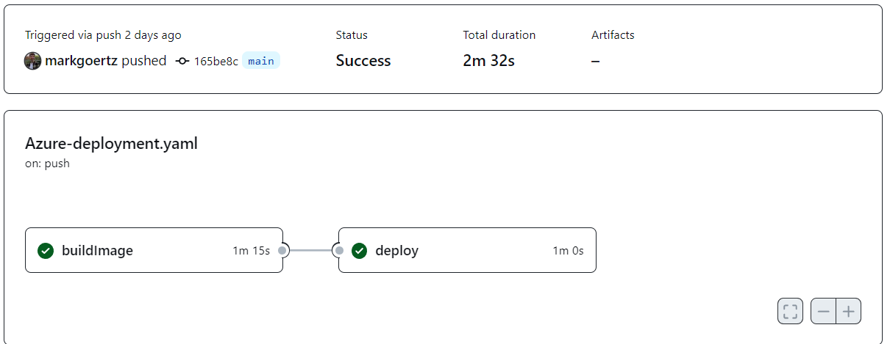

---

<a name="readme-top"></a>

<!-- PROJECT LOGO -->


<div align="center">
  <a>
    
  </a>

  <h3 align="center">DevSecOps-document</h3>

  <p align="center">
    <br />
    <a href="https://github.com/orgs/Morvie/repositories"><strong>View repositories»</strong></a>
    <br />
    <br />
    <a href="">View Demo</a>
    ·
    <a href="https://github.com/Morvie/Documentation/issues">Report Bug</a>
  </p>
</div>

---

<!-- TABLE OF CONTENTS -->
 <h1 id="table-of-contents"> :mailbox_with_mail: Table of Contents</h1>


<details open="open">
  <summary>Table of Contents</summary>
  <ol>
    <li><a href="#introduction"> ➤ Introduction.</a></li>
    <li><a href="#CI-pipeline"> ➤ Continious integration visualised.</a></li>
    <li><a href="#Steps + Tools"> ➤ Steps and tools within the CI-pipeline.</a></li>
    <li><a href="Security"> ➤ Security</a></li> 
    <li><a href="#CD-pipeline"> ➤ Continious deployment</a></li>
    <li><a href="#getting-started"> ➤ Links</a></li>
  </ol>
</details>
<br/>

<h1 id="introduction">Introduction</h1>

Within this document all the general development circle of the GitHub actions will be explained. So, the DevSecOps circle of the Continious integration and Continious Deployment. 

All used tools, examples and how I did set it up will be explained within this document. And what the tools will cover throughout the development of the microservice.

---

<h1 id = "CI-pipeline">CI-pipeline visualised.📌</h1>
<div align = center>
  <a href = "https://github.com/Morvie/Forums.API/actions"></a>
</div>

&nbsp;
&nbsp;

&nbsp;
&nbsp;

<h1 id = "Steps + Tools">Steps and tools within the CI-pipeline.🪜</h1>
<h3>Tools</h3>
<p>The used tools within the CI-Pipeline the following tools are defined below. These tools all add up for a contribution. 

All tools are on a open-source subscription and require no money. But once the project gets extended, it will be required to purchase a subscription for some.

</p>

<table align = center>
  <tr>
    <th>
        <a href = "https://github.com/codecov"></a>
    </th>
    <th>
        <a href = "https://github.com/docker"></a>
    </th>
    <th>
        <a href = "https://www.sonarsource.com/products/sonarcloud/"></a>
    </th>
    <th>
        <a href = "https://github.com/actions"></a>
    </th>
    <th>
        <a href = "https://github.com/snyk"></a>
    </th>
    <th>
        <a href = "https://github.com/dependabot"></a>
    </th>
  </tr>
  <tr>
    <td>
    Code-reports and code-coverage gives the developer a mile-stone experience about the progress of code-coverage.
    </td>
    <td>
      Builds and pushes the code to DockerHub account. 
    </td>
    <td>
      Could also be used as code coverage, but primarily used for static code analysis.
    </td>
    <td>
      Used for making artifacts and making the artifact available for other CI-jobs.
    </td>
    <td>
      Used as a security monitoring feature were the developer gets weekly notifications about possible security issues.
    </td>
    <td>
      Used as a dependency monitoring feature were the developer gets weekly notifications about possible new releases.
    </td>
  </tr>
</table>

&nbsp;
&nbsp;

### Code-Cov + GitHub actions feature usage 
&nbsp;
<div align = "center">
        <a href = "https://github.com/codecov"></a>&nbsp;&nbsp;&nbsp;&nbsp;&nbsp;&nbsp;&nbsp;&nbsp;&nbsp;&nbsp;&nbsp;<a href = "https://github.com/actions"></a>
</div>&nbsp;

Codecov displays an overtime code coverage report. It receives the test report that gets generated within the CI-pipeline, and transfers this to the Code-cov cloud. This makes it easier to see overtime what the added or modified features have done to the code coverage over the projects.

***To showcase what has been done and how it looks to see the monitoring dashboard, will be shown below:***

In order to make the code coverage report with .NET, I needed to add a CI-pipeline extension. This was the extenstion: `danielpalme/ReportGenerator-GitHub-Action@5` which allows the code coverage report to be generated from the xPlat and cobertura dotnet feature for performed Unit tests and Integrations tests within the project. 
 
```YML
      - name: Run tests with coverage
        run: dotnet test --no-build --collect:"XPlat Code Coverage"
      - name: ReportGenerator
        uses: danielpalme/ReportGenerator-GitHub-Action@5
        with:
          reports: 'FeedMessages.Test/TestResults/**/coverage.cobertura.xml'
          targetdir: 'CoverageReports'
          reporttypes: 'HtmlInline;Cobertura'
          verbosity: 'Verbose'
          toolpath: 'reportgeneratortool'
```

Once the report is created, it needs to be consumed later on in the pipeline. So, I used GitHub actions its feature called `Artifacts`. With Artifacts you can make file temporary available for download only or forever, and share the content with other workflows within the pipeline. So, I implemented this feature and uploaded and downloaded the artifacts for later in the progress. 

***See image below for an Artifact:*** 
<div align = center>
 
</div>

#### Upload of artifact:
```yml
      - name: Upload artifact
        uses: actions/upload-artifact@v3
        with:
          name: CoverageReports        
          path: CoverageReports
```
&nbsp;

And showcases once the artifact is uploaded to CodeCov a overview of the code coverage over the microservice. Since CodeCov is `Open Source` it only allows you to upload `two projects` and if you want to upload more projects it will charge you with additional costs.
&nbsp;

<div align = center>
  <a href = "https://github.com/Morvie/Forums.API/actions"></a>
</div>
&nbsp;
&nbsp;

<h1 id = "Security">Security within DevSecOps!🔐</h1> 

&nbsp;
<div align = "center">
        <a href = "https://github.com/dependabot"></a>&nbsp;&nbsp;&nbsp;&nbsp;&nbsp;&nbsp;&nbsp;&nbsp;&nbsp;&nbsp;&nbsp;<a href = "https://github.com/actions"></a>&nbsp;&nbsp;&nbsp;&nbsp;&nbsp;&nbsp;&nbsp;&nbsp;&nbsp;&nbsp;&nbsp;
        <a href = "https://github.com/snyk"></a>&nbsp;&nbsp;&nbsp;&nbsp;&nbsp;&nbsp;&nbsp;&nbsp;&nbsp;&nbsp;&nbsp;     <a href = "https://www.sonarsource.com/products/sonarcloud/"></a>
</div>&nbsp;

### Automated Load testing 🔧

For load testing with K6, I have wanted to use automation. So, in this case I have applied a GitHub actions YML file in which I trigger a `PowerShell` script with my own GitHub actions `self-hosted runner`. The reason to run this on my local machine is simply to not shrink the credits I have available on `Azure`.

The following script has been used to trigger the job in my own machine' runner:

```YML
name: Perform load tests on assigned URL-address. 

on:
  push:
    branches: ["main"]

jobs:
  run-K6-load-tests:
    name: K6 Load Test
    runs-on: self-hosted
    steps:
      - name: Check out repository code
        uses: actions/checkout@v3
        
      - name: Perform load tests 
        shell: powershell
        run: ./scripts/commands/run_load_test.ps1
```
```ps1
# Used docker compose to make sure the Grafana and Influx services are up and running. 
# In order to make the output to be adapted within Influx and show the matrixs into the Grafana dashboard.
docker-compose -f docker-compose.yml up -d 
Write-Output "--------------------------------------------------------------------------------------"
Write-Output "Load testing with Grafana dashboard http://localhost:3000/d/k6/k6-load-testing-results"
Write-Output "--------------------------------------------------------------------------------------"
k6 run /scripts/script.js --out json=test.json --out influxdb=http://localhost:8086/k6 
```

In which resulted in the following jobs to be completed as: 

[](https://github.com/Morvie/FeedMessages/actions/workflows/load-test.yml)

This job has been executed from the `Feeds-microservice`, one of the components that had been deployed to `Azure`.

&nbsp;


### Usage of secrets within the pipelines.
For security within the pipeline, there are a several things I kept in mind. To make sure that the CI/CD pipeline performes the operations in a safe way I decided to do a small investigation of the industry standards. 

For the security maintainance I did the following items to make sure that the pipeline is properly secured:

- **Usage of environment variables**:

   These are used to make the pipeline more secure and not to expose sensitive credentials to the public. For this I used GitHub feature: enviromental variables. And during the CI or CD-pipeline these variables are used whenever the credentials are matching. To give an example, see the image below:

<div align = center>
  <a href = "https://github.com/Morvie/FeedMessages/settings/secrets/actions"></a>
</div>

&nbsp;

These variables are implemented into the ${{ secrets.environmental variable }} parts and take the matching secrets and paste it in there without exposing any credentials.

```yml
  deploy:
    needs: [build, test]
    runs-on: ubuntu-latest    
    steps:
      - name: Checkout
        uses: actions/checkout@v3
      - name: Login to Docker Hub
        uses: docker/login-action@v2
        with:
          username: ${{ secrets.DOCKER_HUB_USERNAME }}
          password: ${{ secrets.DOCKER_HUB_ACCESS_TOKEN }}
      - name: Set up Docker Buildx
        uses: docker/setup-buildx-action@v2
      - name: Build and push
        uses: docker/build-push-action@v3
        with:
          context: .
          file: ./Dockerfile
          push: true
          tags: ${{ secrets.DOCKER_HUB_USERNAME }}/feedmessages:latest
```
&nbsp;

### Static code analysis with SonarCloud


In order to write good and secure code, I implemented several tools to assure the quality of the code. The tools I have used are: 
- DependaBot
- SonarCloud
- Snyk

With SonarCloud I implemented this into the CI-pipeline to check the code quality as seen in the imagine below: And does it show the code-smells, security issues and possible bugs.

<div align = center>
  <a href = "https://github.com/Morvie/FeedMessages/settings/secrets/actions"></a>
</div>
<div align = center>
  <a href = "https://sonarcloud.io/project/issues?resolved=false&types=CODE_SMELL&id=Morvie_Forums.API"></a>
</div>

I also used dependabot for security tracking of code, and if there are issues found it gets marked as issue within the GitHub repository. The developers also receive a notification on the email, so the security issue gets solved as fast as possible. As well as updates on version packages and frameworks which are used within the project. However, not all new versions are needs since for .NET the updated also apply for .NET7 which is not supported for .NET6.

<div align = center>
  <a href = "https://github.com/Morvie/Morvie-Frontend/security/dependabot"></a>
</div>
<div align = center>
  <a href = "https://github.com/Morvie/Morvie-Frontend/pulls"></a>
</div>


&nbsp;

### Docker Linter.

Within this project, the Dockerfile that is used to `containerize` the application with Docker in combination with Docker-compose command. But in order to validate the good practices and prevent errors in the image, I decided to use a tool to lint the Dockerfile. It is called: Docker-lint-action which is implemented on the CI-pipeline and checks the Dockerfile at pull requests. Link to the GitHub page as followed: <a href = "https://github.com/luke142367/Docker-Lint-Action">here</a>. 

The reason to choose it for Pull-Requests is since that the main-branch is protected. So, only commits to the main branch are allowed on pull requests by merging branches. 

```yml
name: Check Dockerfile with Docker linter

on:   

  pull_request:
    branches: []

jobs:
  linter:
    runs-on: ubuntu-latest
    steps: 
    - name: Checkout
      uses: actions/checkout@master
    - name: lint
      uses: luke142367/Docker-Lint-Action@v1.0.0
      with:
        target: ./Dockerfile
      env:
        GITHUB_TOKEN: ${{ secrets.GITHUB_TOKEN }}
```
 


### KubeLinter.

I also used the KubeLinter, which is an Open-Source tool in the CI-pipeline which checks `all Kubernetes YML files`.  For this I needed to configure two YML files which each define the scope of this tracker. And I use this to validate all used YML files for Kubernetes. To ensure I don't use bad practices or errors in Kubernetes for hosting. 

My teacher consulted about the option to use this and look up for an own choice of tool/framework. So, I looked up for a top-10 open-source Kubernetes linters on here:  <a href = "https://developers.redhat.com/articles/2022/06/20/8-open-source-kubernetes-security-tools">here</a>. 

```yml
name: Check Kubernetes YAMLs with kube-linter

on:
  # Note that both `push` and `pull_request` triggers should be present for GitHub to consistently present kube-linter
  # SARIF reports.
  push:
    branches: [ main ]
  pull_request:

jobs:
  scan:
    runs-on: ubuntu-latest
    steps:
      - uses: actions/checkout@v2

      # This prepares directory where github/codeql-action/upload-sarif@v1 looks up report files by default.
      - name: Create ../results directory for SARIF report files
        shell: bash
        run: mkdir -p ../results

      - name: Scan yaml files with kube-linter
        uses: stackrox/kube-linter-action@v1.0.4
        id: kube-linter-action-scan
        with:
          # Adjust this directory to the location where your kubernetes resources and helm charts are located.
          directory: k8s/deploy.yml
          # Adjust this to the location of kube-linter config you're using, or remove the setting if you'd like to use
          # the default config.
          config: k8s/.kube-linter-config.yml
          # The following two settings make kube-linter produce scan analysis in SARIF format which would then be
          # made available in GitHub UI via upload-sarif action below.
          format: sarif
          output-file: ../results/kube-linter.sarif
        # The following line prevents aborting the workflow immediately in case your files fail kube-linter checks.
        # This allows the following upload-sarif action to still upload the results to your GitHub repo.
        continue-on-error: true

      - name: Upload SARIF report files to GitHub
        uses: github/codeql-action/upload-sarif@v2

      # Ensure the workflow eventually fails if files did not pass kube-linter checks.
      - name: Verify kube-linter-action succeeded
        shell: bash
        run: |
          echo "If this step fails, kube-linter found issues. Check the output of the scan step above."
          [[ "${{ steps.kube-linter-action-scan.outcome }}" == "success" ]]
```

This pipeline can be found in the following <a href="https://github.com/Morvie/FeedMessages/actions/workflows/kubelint.yml">link</a>. And for the results of the pipeline workflow, see the <a href="https://github.com/Morvie/FeedMessages/security/code-scanning?query=is%3Aclosed+branch%3Amain"> following link</a> and with closed trigger  <a href="https://github.com/Morvie/MovieMicroservice/security/code-scanning?query=is%3Aclosed+branch%3Amain">results</a>.

&nbsp;


<h1 id = "CD-pipeline">Deployment to Azure!👾</h1> 
<div align = center>
  <a href = "https://github.com/Morvie/Morvie-Frontend/pulls"></a>&nbsp;&nbsp;&nbsp;&nbsp;&nbsp;&nbsp;&nbsp;&nbsp;&nbsp;&nbsp;&nbsp;
  <a href = "https://github.com/Morvie/Morvie-Frontend/pulls"></a>&nbsp;
</div>

---

The deployment of the microservice has been performed with `Kubernetes` and `Azure`. To know what my motivation was to choose Azure as Cloud-provider, I will redirect you to the following document: <a href = "https://github.com/Morvie/Documentation/blob/main/Documents/Cloud-documentation.md">Cloud-documentation</a>.

So, the after the CI-pipeline prepares the application to a deployment, the `Continious deployment` a.k.a `C.D`. In this phase of the whole DevSecOps the application get build on a image and then pushed to the Azure cloud. In order to make this happen, I needed to make a Azure CD-pipeline script for GitHub actions. I generated this by Azure e.g.:

```YML
name: Azure-deployment
"on":
    push:
        branches:
            - main
    workflow_dispatch: {}
env:
    ACR_RESOURCE_GROUP: Morvie
    AZURE_CONTAINER_REGISTRY: morvie
    CLUSTER_NAME: Morvie-cluster
    CLUSTER_RESOURCE_GROUP: Morvie
    CONTAINER_NAME: feedms-image
    DEPLOYMENT_MANIFEST_PATH: |
        ./k8s/deploy.yml
        ./k8s/service.yml
        ./k8s/autoscaler.yml
jobs:
    buildImage:
        permissions:
            contents: read
            id-token: write
        runs-on: ubuntu-latest
        steps:
            - uses: actions/checkout@v3
            - uses: azure/login@v1.4.3
              name: Azure login
              with:
                client-id: ${{ secrets.AZURE_CLIENT_ID }}
                subscription-id: ${{ secrets.AZURE_SUBSCRIPTION_ID }}
                tenant-id: ${{ secrets.AZURE_TENANT_ID }}
            - name: Build and push image to ACR
              run: az acr build --image ${{ env.CONTAINER_NAME }}:${{ github.sha }} --registry ${{ env.AZURE_CONTAINER_REGISTRY }} -g ${{ env.ACR_RESOURCE_GROUP }} -f ./Dockerfile ./
    deploy:
        permissions:
            actions: read
            contents: read
            id-token: write
        runs-on: ubuntu-latest
        needs:
            - buildImage
        steps:
            - uses: actions/checkout@v3
            - uses: azure/login@v1.4.3
              name: Azure login
              with:
                client-id: ${{ secrets.AZURE_CLIENT_ID }}
                subscription-id: ${{ secrets.AZURE_SUBSCRIPTION_ID }}
                tenant-id: ${{ secrets.AZURE_TENANT_ID }}
            - uses: azure/aks-set-context@v3
              name: Get K8s context
              with:
                cluster-name: ${{ env.CLUSTER_NAME }}
                resource-group: ${{ env.CLUSTER_RESOURCE_GROUP }}
            - uses: Azure/k8s-deploy@v4
              name: Deploys application
              with:
                action: deploy
                images: ${{ env.AZURE_CONTAINER_REGISTRY }}.azurecr.io/${{ env.CONTAINER_NAME }}:${{ github.sha }}
                manifests: ${{ env.DEPLOYMENT_MANIFEST_PATH }}
                namespace: default

```

And this resulted into the pipeline running independently from the other components. 
<div align = "center">
  <a href = "https://github.com/Morvie/FeedMessages/actions/workflows/Azure-deployment.yaml"></a>&nbsp;
</div>


<h1 id = "getting-started">Used Links🔗</h1> 

- Production-Grade Container Orchestration. (z.d.). Kubernetes. https://kubernetes.io/

- ? R. (z.d.). Azure documentation. Microsoft Learn. https://learn.microsoft.com/en-us/azure/?product=popular

- Quick Start. (z.d.). Codecov. https://docs.codecov.com/docs

- GitHub Actions Documentation. (z.d.). GitHub Docs. https://docs.github.com/en/actions

- Mickey Gousset. (2021, 27 september). GitHub Actions - Upload Artifacts. YouTube. https://www.youtube.com/watch?v=vlySg5UPIm4

- TechWorld with Nana. (2020, 8 oktober). GitHub Actions Tutorial - Basic Concepts and CI/CD Pipeline with Docker. YouTube. https://www.youtube.com/watch?v=R8_veQiYBjI

- Anton Putra. (2021, 3 november). GitHub Actions Self Hosted Runner (Autoscaling with Kubernetes). YouTube. https://www.youtube.com/watch?v=lD0t-UgKfEo

- Andrew Schmelyun. (2022, 9 september). Using Docker Containers with GitHub Actions. YouTube. https://www.youtube.com/watch?v=U7TY_qUD8yA

- Nick Chapsas. (2022, 25 juli). The cleanest way to use Docker for testing in .NET. YouTube. https://www.youtube.com/watch?v=8IRNC7qZBmk

- -, R. (2022, 22 november). Create an ingress controller in Azure Kubernetes Service (AKS) - Azure Kubernetes Service. Microsoft Learn. https://learn.microsoft.com/en-us/azure/aks/ingress-basic?tabs=azure-cli

- GitHub Marketplace: to improve your workflow. (z.d.). GitHub. https://github.com/marketplace

- Oram, Andy. 8 open source Kubernetes security tools. Red Hat Developer. https://developers.redhat.com/articles/2022/06/20/8-open-source-kubernetes-security-tools

- GitHub, L. (z.d.). GitHub - luke142367/Docker-Lint-Action: A GitHub action for linting Docker Files. GitHub. https://github.com/luke142367/Docker-Lint-Action