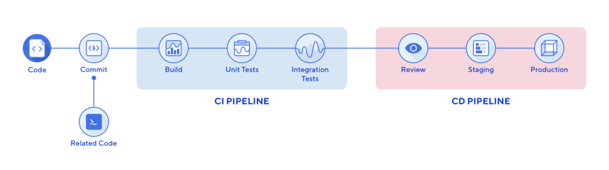

---

<!-- PROJECT LOGO -->

  

  <h3 align="center"></h3>

  

     
    <a href="https://github.com/orgs/Morvie/repositories"><strong>View repositories»</strong></a>
     
     
    <a href="">View Demo</a>
    ·
    <a href="https://github.com/Morvie/Documentation/issues">Report Bug</a>
  

---

<!-- TABLE OF CONTENTS -->
 <h2 id="table-of-contents"> :mailbox_with_mail: Table of Contents
 </h2>

  
Table of Contents

  <ol>
    <li><a href="#introduction"> ➤ Introduction.</a></li>
    <li><a href="#CI-pipeline"> ➤ Continious integration visualised.</a></li>
    <li><a href="#Security"> ➤ Steps within the CI-pipelins.</a></li>
    <li><a href="#CD-pipeline"> ➤ Continious deployment</a></li>
    <li><a href="#getting-started"> ➤ Links</a></li>
  </ol>

 

<h2 id="introduction">Introduction</h2>

Within this document all the general development circle of the GitHub actions will be explained. So, the DevSecOps circle of the Continious integration and Continious Deployment. 

All used tools, examples and how I did set it up will be explained within this document. And what the tools will cover throughout the development of the microservice.

---

<h2 id = "CI-pipeline">CI-pipeline visualised.</h2>

