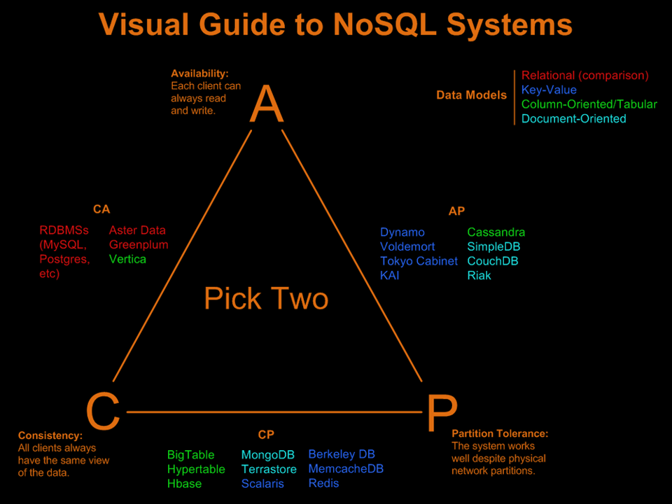

---

<!-- PROJECT LOGO -->

  

  <h1 align="center">GDPR + Observability and Performance documentation</h1>
  <h3 align="center">Morvie Documentation</h3>

  

     
    <a href="https://github.com/orgs/Morvie/repositories"><strong>View repositories»</strong></a>
     
     
    <a href="">View Demo</a>
    ·
    <a href="https://github.com/Morvie/Documentation/issues">Report Bug</a>
  

---

<!-- TABLE OF CONTENTS -->
 <h1 id="table-of-contents"> :mailbox_with_mail: Table of Contents</h1>

  
Table of Contents

  <ol>
    <li><a href="#GDPR and Data comlexity"> ➤ GDPR and Data complexities.</a></li>
    <li><a href="#Distributed data"> ➤ Distributed data.</a></li>
    <li><a href="#Observability tools"> ➤ Observability tools.</a></li>
  </ol>

 

&nbsp;
&nbsp;

<h1 id = "GDPR and Data comlexity">🔏 GDPR and Data complexities</h1>

## 1 - Lawful basis and transparency

* Art. 6 GDPR: Lawfulness of processing
* Art. 12 GDPR: Transparent information,communication and modalities for the exercise of the rights of the data subject.
* Art. 30 GDPR: Records of processing activities

---

Morvie as the application holds several data topics. These topics are personal data, movie data and user input data (such as user given reviews and ratings). So, this will explain what will be done with the personal data of our customers.

`Personal data` gets collected by the application in order to make it run operations. Only the username, password and a unique email address is required to create a personal account. And with the personal account the user would be able to create a feed within the forums about a movie. So, at registry the application will create a unique personal identifier so that the application can use this identifier to allocate the forums with the correct account. The email of the user will be used to make sure that the user can login and/or can perform a 'forgot my password' recovery whenever the user forgot this (possibility in the near future as a feature). And thus can recover the account. 

The operators of morvie can not see the personal information of the user since `keycloak` user management service uses a plugin that encrypts the personal information of the user. It is called `Secure Credentials Store - Vault SPI`. And by user roles only limited operators can access the encrypted personal information for development purposes and are qualified for accessing this section. 

The authentication service and the morvie application share a `single connection`. And that is when the user wants to login into the morvie system. Which is secure by a secure connection: `HTTPS`. And uses the secure way of authenticating: `OAuth2.0` in which the authentication service lets the user directly communicate with the authentication service for a token. And once it is valid, the user will receive a heavy encrypted by `RS456` token that contains an access and authorization-token. In which the user can perform operations. 

    

&nbsp;
&nbsp;

The personal data, storage location, usage of the data and duration of holding this data is important to be explained. Within the table below, this will bee explained. Thereby, I hope to inform the usage of the personal data within this application.

<table align = center>
  <tr>
    <th width="200">
        Personal data type
    </th>
    <th width="600">
        Location of storage
    </th>
    <th width="600">
        Usage of this data.
    </th>
    <th width="600">
        Duration of holding this data
    </th>
  </tr>
  <tr>
    <td>
       Email-address + username + password
    </td>
    <td>
        Stored in a Keycloak authentication database server, which is stored locally on the developers laptop. With a single connection by keycloak and the database. It can still be deleted by keycloak.
        The database is an <code>PostgreSQL database.</code>
    </td> 
    <td>
        This data gets used to validate the user on registry and authentication and/or authorization operations. It is an identifier of the unique user.
    </td> 
    <td>
        This data gets stored as long as the user is active. The initial plans for implementing GDPR friendly data-removal will be done when the user is no longer active and have not logged in  within the past 2 years. The user will receive multiple notifications by mail to log in otherwise the data will be removed and destroyed.
    </td> 
  </tr>
  <tr>
    <td>
       User Identifier
    </td>
    <td>
        Will be stored within the keycloak user database using <code>PostgreSQL database</code> and the Feed- and Forums-database using <code> MSQL database</code>
    </td> 
    <td>
      This data will be used to make a connection between the user-made feed and/or forums. In order to let the application make a correlation between the owner of the feed/forum and the feed/forum itself.
    </td> 
    <td>
      It remains as long as the user wants it feed/forum to be shown on the website. Unless it is inapropriate to display, it will be destroyed immediately with the user identifier. And the user is free for removal of the feed/forums.
    </td> 
  </tr>
  

</table>

&nbsp;

#### Data processing and legal justifications.

Within the user registery form, there will be a `clear` and `big` text box in where the user is mandatory to read the usage and collection of user personal data over the email address and password. And will let the user continue after it fully red the usage over their information and collection. 

&nbsp;
&nbsp;

## 2 - Data security

---

&nbsp;
&nbsp;

## 3 - Accountability and governance

* GDPR Article 25 – Data protection by design and by default

* GDPR Article 27 – Representatives of controllers or processors not established in the Union

* GDPR Article 37 – Designation of the data protection officer
---

Within Morvie organization, there is no `Data Protection Officer` simply because the team is too small for this. And so does the development team need to take this in account. The developers are constantly monitoring the data protection and GDPR compliance. And act as a team of advisers and implement these advise.

The company acts within the European Union and so, there needs no reponsible representative in each country to represent to the data protection authorities. And since this company is operative within the `European Union`, the rules validation of GDPR complaince `apply to all member states of the European Union`.

With using a cloud provider which does the hosting and infrastructure of "Morvie", the contract of hosting the data service is signed by the purchase. Since the cloud provider `Azure` is of product name of  `Microsoft` and will be stored on a server in `North-Germany`. It is a risk of using a `public` hosting provider, but the costs currently does not allow to buy our own `private hosting domain`. 

The current reponsible person over ensuring the GDPR compliance accros the organization is the `developer: Mark Goertz`. And will be reponsible for creating awareness to the new members of the organization and will the desicion makers be informed about the data protection legislation.

&nbsp;
&nbsp;

## 4 - Privacy rights

* GDPR Article 15 – Right of access by the data subject
* GDPR Article 16 – Right to rectification
---

When the user what to access its personal information it can send a email to `Data Protection Officer`. Or fill in a GDPR form (which is currently not going to be implemented) and create a ticket to the Data protection officer. This person will prepare the personal information and send this to the person who requested the form.

The person is currently not able to modify the personal information on its own. But this can be implemented in which the user will communicate directly to the backend service that processes this action. And the data will be `end-to-end encryption` so it becomes not readable.

As well as the option to delete the personal information. This is currently been done by the DPO on request.
&nbsp;

<h1 id = "Distributed data">📅 Distributed data | CAP theorem</h1>
The CAP theorem is a way to validate the distributed data systems. A distributed data system provider can be divided into three selections. 

    

#### Information and given examples.
The selection above describe the guarantees that you can promise to the users. But the promise can not be all three of them, but only 2. Explained what all guarantees are it will be explained below:

- `Consistency`: All clients have the same view of the data. So, this means that the users all see the most recent write or otherwise receive an error. And means that the data, the latest write data, is also highly accurate. Since consistency aims to be consistend.

- `Availability`: The guarantee promises users that the database service is more important than the information. These databases are widly seen in E-commerce businesses and applications. These databases replicate themselves when receiving a higher load than they can process.

- `Partion Tolerance`: This guarantee gives the users the guarantee that the database system will work well despite the physical network partions. So, the database cluster will continue to work even when two seperate nodes can not communicate with each other.

#### Choice within the project.
Within the project, I have decided to choose the following databases:
- `MSSQL database`: which runs on Docker.
- `Azure(MySQL) database`: Which runs on Azure Cloud environment.

With these chosen databases, I will explain which parts the database system will cover of the CPA theormen. Both of these databases will cover the CA parts of the CPA theorem, since it is only possible to cover two out of the three parts. With `Consistency` and `Availability` covered. The database system will write a high volume of data with a high accuracy. And will it load replicate itselves when the load gets too much. 

With `MSSQL` database, the feature `always on` is enabled on the local development environment. And can automatically perform availability. 

The `Azure|MySQL database` will be used on the cloud environment. Which will automatically scale up by Azure services when needed. This brings an addional server usage costs, but it only charges only what the company requires.

#### Use-case within project.
My usage within this project would be a `Azure MySQL database`. Within this database it can automatically scale up when needed, and the availability is promised by Azure by `99.95%` in a year. That is `4,38 hours downtime` of a whole year.

<h1 id = "Law">GDPR undertaken activities.</h1>

In order to apply the GDPR laws into our system to make it GDPR-proof, the following activities have been undertaken:

* Personal data can be managed by the owner of the data:

  
  The user has once it is logged in into the system to view the options: Personal info, Account security and used applications.

&nbsp;

With the option: `Personal info`, the user can view its own personal information of the their account. 

Modify the user attributes (username is not adjustable since it is a unique attribute and not needed for GDPR compliant)

And delete the personal account with all its data, this action is truely irreversible. 

  

#### Account security

The user can manage the security of their account with login providers, viewing device activity information and signing in information (and configure 2FA). Which is great for the CIA-triad requirements.

  

  

The accounts are not visible for the administrators of keycloak, and thus within the requirements of GDPR. Example given:

  
This is the view of the administrator, it only has view over the events, realm-settings and current sessions. But it can not create any users or view users.

<h1 id = "Distributed system">Scalable distributed enterprise system</h1>

For this project, I build two microservices on a CQRS code pattern. This is pattern which divide the application in two different services as `READ-operations` and `WRITE-operations`. 

*Why is this good for distributed system?*

- With the usage of Command Query Seggregation Responability, it distributes data faster than the traditional repository code pattern. The reason is that it gives the application an seggregation in between these two operations, which allows the application to perform what is important. If the write operations are getting more used, it can autoscaling of kubernetes to scale up the server usage either horizontally or vertically.

And also can the application use the benefits of SQL and NoSQL databases since SQL have a faster performance in reading data from the SQL database, where the NoSQL database has a better performance in writing and handling data. I performed research about this which can be seen <a href="https://github.com/Morvie/Documentation/blob/main/Documents/Scalability-documentation.md">here</a>.

The disadvantage of using CQRS is that it makes the application harder to understand and maintain. This could trouble future updates and maintainance on the application.

Used Messaging.
--> behouden van berichten en intercommunicatie tussen writer en receiver.

Within the pro

Elk microservice heeft eigen database.

Kubernetes autoscale the docker container by certain percentage and scale up the pods horizontal

<h1 id = "Observability tools">🔧 Observability tools</h1>

Grafana scalable loading

Keycloak user data modification.

Keycloak session usage

Keycloak session monitoring.

---

# Sources:

- GDPR.eu. (2022, May 26). GDPR compliance checklist. https://gdpr.eu/checklist/

- Fontys (2021). Cyber Security https://fhict.instructure.com/courses/11556/pages/reference-law-standards-and-compliance?module_item_id=680345

- Advisera.com (2022, April 13). Top 10 GDPR Requirements https://advisera.com/eugdpracademy/knowledgebase/a-summary-of-10-key-gdpr-requirements/

- What is the CIA Triad? Definition, Importance & Examples. (2022, 8 oktober). SecurityScorecard. https://securityscorecard.com/blog/what-is-the-cia-triad

- Savjani, S. (2022, 29 november). Hoge beschikbaarheid - Azure Database for MySQL. Microsoft Learn. https://learn.microsoft.com/nl-nl/azure/mysql/single-server/concepts-high-availability