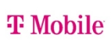

# Message Broker research

## What is a message broker?

A message broker is a software component that enables applications and services to communicate with each other and exchange information. The message broker ```translates``` the information into a messaging protocol that all services can receive. And so, the message broker can even exchange between two application or services that are both written in different methodology or programming language. 
The application or service that produces a message and sent it to the message broker is called the: ```producer```. The producer is responsible for sending the message to the message broker and that it! 

Also does the message broker provide a reliable way to handle messages and requests. This is because the message broker has a in-build component/substuctor, called a ```message queue```. When the application or service suddenly goes offline, the message queue will store and order the messages until the application or service comes back online. 

Once the application or service is online, the message broker will send in small bulks messages to the application or service again. But in a balanced way in order to not overload the application or service. The most important messages gets sent first to the application or service since these are essential. And later the application or service will consume the other incomming messages. And this is why it is given the name: ```Consumer```.

The message broker has also a purpose to `'break'` messages and devide these to the needed application or services. And so, the message gets forwarded to the application or service that needs to receive the message. In this role, the message broker will act independently towards the application or services and will redirect the message according to the content in the message.

&nbsp;

<div align=center>
    <a href = "https://ademcatamak.medium.com/what-is-message-broker-4f6698c73089" ></a>
</div>

&nbsp;
&nbsp;

## What are the available providers for message brokers?

There are a several providers available that could provide as a message broker within this project. For the scope of the project, we must consider a few options and possibilities for this project which is build in .NET. But needs to have an open option to use the message broker with other languages as well for future developers.  

&nbsp;
&nbsp;


## RabbitMQ:
It is an open-source message broker that delivers message efficiently in a complex routing scenario. It runs with clusters of nodes and the queues of messages get distributed across the nodes, so that the availability remains high. 

It is one of them most popular open-source message brokers currently available. It provides a lightweight and easy to deploy on premises and in the cloud-environment. It can either run on an installed operation system as an .exe, virtual environment, Docker container and Kubernetes Cluster.

<div align=center>
    
</div>

&nbsp;

#### The features RabbitMQ supports:

- `Multiprotocol` support (REST, STOMP HTTP, web Sockets, MQTT etc.)
- Supports `synchronous` and `asynchronous` communication.
- `Scalability` to handle thousands of messages per second.
- `Large community support`, since RabbitMQ is long exiting since 2007. 
- Many `programming language support` with 42 language or platform support.
- It comes with a `management GUI`, which allows the developer to monitor and control aspects of the message broker.
- Error `Tracing` to debug the message broker and find the misbehavior.
- `Supports` usage of plugins, which can extend the broker functionality, protocol or system state monitoring. These can be activated by the RabbitMQ CLI. 
- `Security` RabbitMQ uses various ways to protect messages. RabbitMQ has all messages secured with `TLS/SSL encryption` for data in transit. And is all messages in the RabbitMQ disk encrypted with `LUKS using AES-256 encryption.`

&nbsp;

#### Companies that use RabbitMQ: 

<table align = center>
    <th>
        <a href = "https://reddit.com/"></a>
    </th>
    <th>
        <a href = "https://trivago.com/"></a>
    </th>
    <th>
        <a href = "https://circleci.com/"></a>
    </th>
    <th>
        <a href = "https://mollie.com/"></a>
    </th>
    <th>
        <a href = "https://t-mobile.com/"></a>
    </th>
</table>

&nbsp;
&nbsp;

### Usage of RabbitMQ in a project:  

With the current scope of the project, which is primarily built with an .NET6 environment, I will clarify on how RabbitMQ could be used in the project. 

It is recommended to use [Mass Transit project](https://masstransit-project.com/). This is an open-source distributed application framework that is special made for .NET. So, it is suitable for our project since the microservices are built in .NET. And makes heavily use of a RabbitMQ instance.

The goal of this framework is to add more consistency into the project on a friendly .NET abstraction over message transport. Which can be done over RabbitMQ and other message transport providers such as ‘Azure Service Bus’. And add some powerful perks of the framework into the project such as:

&nbsp;

**Support for message header and correlation**

- It comes with a message envelope that is included with possibilities for headers, conversations, correlation and request options. Which fulfilled the message envelope and made ready for use.

**Makes Unit testing easy**

- Since RabbitMQ is just infrastructure code, it makes it hard to unit test this. So, Mass Transit comes included with a high-performance and in-memory transport for testing every consumer that would be used in production.

**Serialization**

- RabbitMQ works with bytes, where C# works with a statically typed language. So, in order to connect the wires of the format of the message, this has already been done by Mass Transit. It serializes inputs such as JSON, BSON, XML and the .NET binary formatter into a readable RabbitMQ bytes.

**Monitoring Benefits**

- With RabbitMQ, it comes with a suport of monitoring. This comes out of the box and provides the ability to monitor services, liveliness and the ablity to tracing.

&nbsp;

And so does MassTransit come with a widly documented tutorial docs and support. So, implementing MassTransit into the project would not be a big problem.

&nbsp;
&nbsp;

&nbsp;
&nbsp;


## Apache Kafka:
Is an open-source distributed event streaming platform for high-performance data pipelines, streaming analytics, data integration, and mission-critical applications. It promises to provide a high throughput message to delivery with latencies of 2ms, scalable production clusters and a high availability of clusters. 

Kafka can be either downloaded or pulled as a Docker image. And has the option to use Kubernetes Clusters to deploy this message broker. It does not come along with a GUI like RabbitMQ has and can be interacted with a Command Line Interface (CLI). The option for a GUI is optional but requires more configurations to be done than RabbitMQ, which has this feature in-the-box. 

&nbsp;
&nbsp;

**The features Kafka supports:**

- **Scalability** it can scale up the data prodcuers, data brokers and data consumers. And can actively scale up wheter the needs. And provides a `high-throughput, low-latency` platform, perfect for handling real-time data.

- **Reliability:** Kafka has requirement and promises a `zero-downtime` by using their services and so, no dataloss or offline service. And can `restart servers by its own`.

- **Fully Configurable** Data can be stored over a short term and retentions can be configured. By default, Kafka has a `rentention policy` of 7 days. By default, Kafka does not comes with a out-the-box administration interface, where the developer can monitor or configure settings and messages. However, this can be added and configured!

- **Open-Source** The Kafka services are `free` and there are `no license fees` for using Kafka!


&nbsp;
&nbsp;

**Companies that use Apache Kafka:**
<table align = center>
    <th>
        <a href = "https://zalando.com/"></a>
    </th>
    <th>
        <a href = "https://rabobank.com/"></a>
    </th>
    <th>
        <a href = "https://adidas.com/"></a>
    </th>
    <th>
        <a href = "https://nytimes.com/"></a>
    </th>
    <th>
        <a href = "https://pinterest.com/"></a>
    </th>
</table>
&nbsp;

### Usage of Kafka in the project: 

There is no fancy framework available for Apache Kafka since Kafka provides enough support. However there are some packages that is needed for installation with `NuGet`, `NPM` or whatever the developer needs. Asuming it is .NET, it would be `NuGet`. And since Apache Kafka is widly used, there are many tutorials available to integrate Apache Kafka into the project. The Kafka message broker needs to be installed by either running a `docker` container or installing a .exe file that will allow me to run it locally.

<a href="https://www.red-gate.com/simple-talk/development/dotnet-development/using-apache-kafka-with-net/">Tutorial for building Apache Kafka with .NET6</a>

&nbsp;
### Sources:

- Hasan, T. (2022, August 31). *6 Top Message Brokers for Modern Applications*. Geekflare. <https://geekflare.com/topmessage-brokers/>
- <https://www.rabbitmq.com/features.html#:~:text=RabbitMQ%20offers%20a%20variety%20of,publisher%20confirms%2C%20and%20high%20availability>.
- SonoSuite. (n.d.). *Why developers like RabbitMQ*. StackShare. <https://stackshare.io/rabbitmq>
- Doe, S. (2022, November 2). *Kafka vs RabbitMQ: What Are the Biggest Differences, and Which Should You Learn?* Simplilearn.com. <https://www.simplilearn.com/kafka-vs-rabbitmq-article>
- *What does MassTransit add to the transport? | MassTransit*. (n.d.). <https://masstransit-project.com//understand/additions-to-transport.html>
- Catamak, A. (2021, December 15). What is Message Broker |RabbitMQ | Event | Command. Medium. https://ademcatamak.medium.com/what-is-message-broker-4f6698c73089
- Message Brokers. (2021, July 16). https://www.ibm.com/nl-en/cloud/learn/message-brokers
- Singh, B. (2021, December 10). Main Features of Apache Kafka. - Brijesh Singh. Medium. https://medium.com/@brijesh1794/main-features-of-apache-kafka-bcba2ed2e86
- (2022, January 27). Top 10 Apache Kafka Features That Drive Its Popularity. Dattell. https://dattell.com/data-architecture-blog/top-10-apache-kafka-features-that-drive-its-popularity/
- Troubleshooting TLS-enabled Connections — RabbitMQ. (n.d.). https://www.rabbitmq.com/troubleshooting-ssl.html


