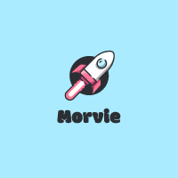

---

<!-- PROJECT LOGO -->
 

  

  <h3 align="center">Documentation</h3>

  

     
    <a href="https://github.com/orgs/Morvie/repositories"><strong>View repositories»</strong></a>
     
     
    <a href="">View Demo</a>
    ·
    <a href="https://github.com/Morvie/Documentation/issues">Report Bug</a>
  

---

# :raising_hand: Introduction

Dear reader, in this document you can find everything about my products and the completed processes I personally went through this semester. But first, let me introduce myself.

My name is Mark Goertz, and I am a student at Fontys HBO-ICT bachelor education at Eindhoven. With the sixth semester as the current semester, I am safe to say I do have some knowledge within the software world.

Before this current semester, I performed a software internship at the company called: IPTV and solutions company called: ‘Stream-group’. During this time, I gained a lot of software skills and learned to be more professional within the work environment. But also, trouble shooting and finding the best possible solution for the client. And do I have gained a little bit of information about enterprise software; like the concepts and how does non-functional user requirements matter more within these software products.

For this semester, I am willing to learn new programming languages but also already experienced languages. So, that I can develop myself in my skills. The languages I would likely be learning from scratch this semester would be <a><strong>C#</strong> with <strong>.NET6 and JavaScript with React.js.</strong></a> 

My goal would be to pass this semester and go to the next semester with more professionalism and technical knowledge. 

 

---

# :file_folder: Contributed projects.

Within this semester, I am contributing to two projects: an individual and group project. For both projects an enterprise software will be created. 

The individual project will be used to show learning outcomes that are hard to show with group projects, for example: learning outcome 6: “Cloud services”.  In this individual project I will make a clone mixture of a famous movie rate website called: “IMDB” and forum website: “Reddit”. And am I willing to use third party applications to gain information and data about several subjects like movies and news. 

For the group project, I am a contributor for the Fontys project: “Blind date”. This project is created by Fontys Pedagogy to support visually impaired individuals in relationships and sexuality development. The goal is to create an online support community where healthy individuals can help visually impaired people by giving advice on several subjects. And I will try to create a best possible solution along with my group members for the Product Owner and stakeholders!

 

---

### :hammer_and_wrench: Languages and Tools :

This section should list any major frameworks/libraries used to bootstrap your project. Leave any add-ons/plugins for the acknowledgements section. These tools get chosen throughout the project.

    &nbsp;
  &nbsp;
  &nbsp;
  &nbsp;
  &nbsp;
  &nbsp;
  

 

---

### Maintainers SEP 2022 - JAN 2023

---

<table align=center>
  <tbody>
    <tr>
     <td align="center"><a> <b>Mark Goertz</b></a></td>
  </tbody>
</table>

---

This project is an assignment of:
Fontys: University of Applied Science

(<a href="#readme-top">back to top</a>)

